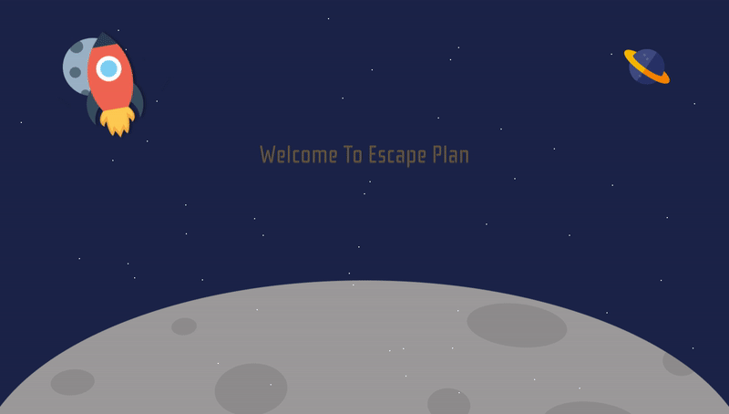

# Escape Plan

2D Grid Multiplayer Game Using Socket.io / Node.js / Vanilla Js



# Prerequisites

- Node.js

# Getting Started

1. Install dependencies

```sh
npm install
```

2. Start the server

```sh
node app.js
```

3. The game client will be running at [http://localhost:8080](). Open it with your browser.
